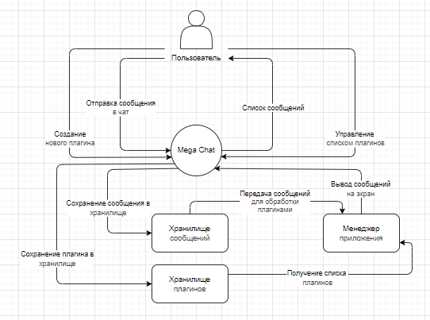
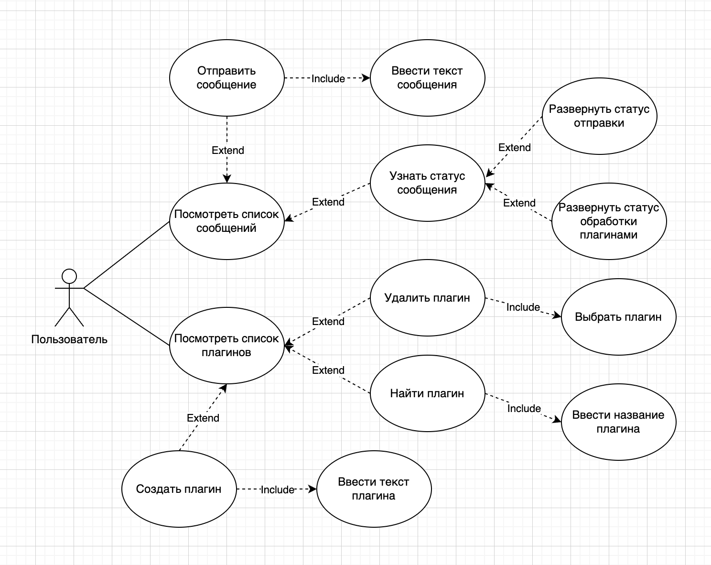
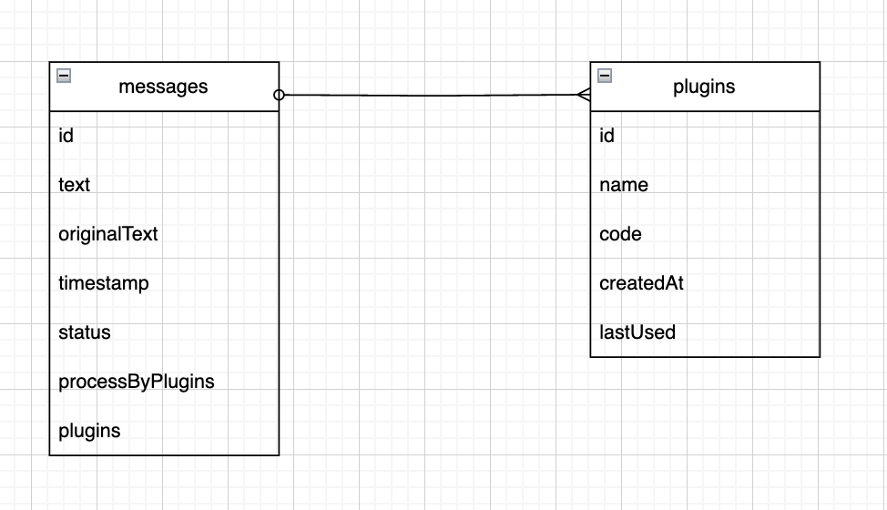

# Техническое задание

## 1. Введение

### 1.1. Цель

Это техническое задание описывает функциональные и нефункциональные требования к версии 1.0.0 веб-приложения "Mega Chat". Этот документ предназначен для использования командой разработчиков в качестве справочника при разработке. Кроме специально оговоренных случаев, в документе используются следующие термины и определения:

- "система" - означает веб-приложение "Mega Chat" версии 1.0.0;
- "пользователь" - означает пользователя веб-приложения "Mega Chat" версии 1.0.0;
- "разработчик плагина" - означает пользователя, который создает плагин для веб-приложения "Mega Chat" версии 1.0.0;

### 1.2 Соглашения принятые в документе

В этой спецификации нет никаких специальных или иных обозначений.

### 1.3. Границы проекта

Первая версия системы будет представлять собой веб-приложение чата с возможностью расширения функциональности через плагины. Оно позволит пользователям отправлять сообщения в чат, а также использовать различные плагины для обработки исходящих сообщений. Все исходящие сообщения будут проходить через все имаеющиеся у пользователя плагины. Пользователь может в любой момент получить роль "Разработчика плагина" и создавать свои плагины, которые будут применятся к сообщениям в чате.

## 2. Общее описание

### 2.1. Общий взгляд на систему

### 2.2. Классы пользователей и их характеристики

В системе определены следующие классы пользователей:

1. Обычный пользователь (Regular User)
   - Может отправлять сообщения
   - Может просматривать список сообщений в чате
   - Может управлять списком плагинов (добавлять, удалять)

2. Разработчик плагинов (Plugin Developer)
   - Обладает всеми правами обычного пользователя
   - Может создавать новые плагины

### 2.3 Операционная среда

**ОС-1** Веб-приложение Mega Chat должно работать со следующими браузерами: Google Chrome версии с 129 по текущую

### 2.4 Ограничения проектирования и реализации

**ОП-1** Веб-приложение Mega Chat должно быть разработано с использованием современных стандартов, таких как HTML 5, CSS 3, JavaScript ES6+. С ограничением на использование UI библиотек и UI фреймворков.

**ОП-2** Веб-приложение Mega Chat должно обеспечить безопасную среду для исполнения кода плагинов

**ОП-3** Веб-приложение Mega Chat должно быть разработано с использованием JavaScript классов с четким разделением между публичными и приватными методами и свойствами.

**ОП-4** Веб-приложение Mega Chat в первой версии не должно использовать серверную часть для обработки сообщений. Все сообщения должны обрабатываться в браузере пользователя. Вся работа должна происходить только с исходящими сообщениями.

**ОП-5** Созданные в приложении Mega Chat плагины должны иметь возможность доступа к DOM объектам веб-приложения

### 2.5. Предположения и зависимости

**ПЗ-1** Веб-приложение Mega Chat будет использоваться только в браузере

**ПЗ-2** Веб-приложение Mega Chat будет использовать IndexDB для хранения сообщений и плагинов

**ПЗ-3** Веб-приложение Mega Chat будет хранить плагины в формате Blob

**ПЗ-4** Веб-приложение Mega Chat будет использовать IFrame для безопасного выполнения плагинов

## 3. Функции системы

### 3.1. Описание функций

#### 3.1.1 Управление сообщениями

**Ф-1** Отправка сообщений
- Система должна позволять пользователям отправлять текстовые сообщения
- Сообщения должны сохраняться в хранилище сообщений
- Система должна показывать статус обработки сообщения плагинами
- Система должна показывать статус отправки сообщения

**Ф-2** Просмотр сообщений
- Система должна отображать список всех сообщений в чате
- Сообщения должны отображаться в хронологическом порядке
- Система должна обновлять список сообщений при добавлении пользователем нового сообщения
- Система должна отображать детали статусов сообщения (время отправки, время доставки, время прочтения, статус доставки, статус прочтения, статус обработки плагинами)

#### 3.1.2 Управление плагинами

**Ф-3** Создание плагинов
- Пользователи должны иметь возможность создавать новые плагины путем написания кода на языке JavaScript
- Система не должна немедленно проверять код плагина на безопасность или работоспособность
- Созданные плагины должны сохраняться в хранилище плагинов в формате Blob

**Ф-4** Управление списком плагинов
- Пользователи должны иметь возможность удалять плагины по одному или все сразу
- Система должна отображать список доступных на текущий момент плагинов
- Пользовтели в текущей версии не должны иметь возможности отключать плагины, только удалять

#### 3.1.3 Обработка сообщений плагинами

**Ф-5** Обработка входящих сообщений
- Система не должна обрабатывать входящие сообщения в текущей версии

**Ф-6** Обработка исходящих сообщений
- Система должна передавать все исходящие сообщения на обработку активным плагинам при каждом отправлении сообщения пользователем
- Плагины должны иметь возможность изменять содержимое исходящих сообщений по логике, заложенной в плагине
- Система должна отображать обработанные сообщения пользователю и их статусы

#### 3.1.4 Администрирование

**Ф-7**  Модерация контента
- Не предусмотрена в текущей версии

**Ф-8**  Управление плагинами
- Не предусмотрено в текущей версии

### 3.2. Use Cases

### 3.3. Варианты использования

#### ВИ-1: Отправить сообщение

**Контекст использования**: Пользователь хочет отправить сообщение

**Область действия**: Система обмена сообщениями и система плагинов

**Основное действующее лицо**: Обычный пользователь

**Предусловие**: 
- Пользователь написал сообщение в окне ввода сообщения

**Гарантии успеха**: 
- Сообщение сохранено в хранилище
- Сообщение обработано всеми активными плагинами
- Сообщение имеет статус "Обработано плагинами"
- Сообщение имеет информацию о времени отправки
- Сообщение отображается в списке сообщений чата

**Триггер**: Пользователь нажимает кнопку "Отправить сообщение"

**Базовый сценарий**:
1. Пользователь вводит текст сообщения
2. Система проверяет доступность хранилища
3. Система сохраняет сообщение в хранилище 
4. Система передает сообщение из хранилища на обработку активным плагинам Менеджеру приложения
5. Система проверяет наличие активных плагинов
6. Плагины обрабатывают сообщение
7. Система добавляет информацию об обработке плагинами в сообщение
8. Система добавляет в сообщение информацию о времени отправки
9. Система отправляет сообщение в чат
10. Система отображает сообщение и мета информацию в чате

**Альтернативный сценарий**:
2.1. Система не может получить доступ к хранилищу
2.2. Система отображает пользователю сообщение о невозможности отправить сообщение

**Альтернативный сценарий**:
3.1. Система не может найти активные плагины
3.2. Система добавляет в сообщение информацию о том, что плагины не найдены
3.3. Система добавляет в сообщение информацию о времени отправки
3.4. Система отправляет сообщение в чат
3.5. Система отображает сообщение и мета информацию в чате

#### ВИ-2: Узнать статус сообщения

**Контекст использования**: Пользователь хочет узнать статус своего сообщения

**Область действия**: Система обмена сообщениями

**Основное действующее лицо**: Обычный пользователь

**Предусловие**: 
- Пользователь видит список сообщений в чате

**Гарантии успеха**: 
- Система отображает статус сообщения

**Триггер**: Пользователь кликает по сообщению в списке

**Базовый сценарий**:
1. Пользователь кликает по сообщению в списке
2. Система отображает детали статуса сообщения и статус обработки плагинами

**Альтернативный сценарий**:
3a. Пользователь кликает на детали статуса сообщения
4a. Система отображает детали статуса сообщения (время отправки)

**Альтернативный сценарий**:
3a.1. Система не может отобразить статус
3a.2. Система отображает пользователю надпись "Статус не доступен"

**Альтернативный сценарий**:
3b. Пользователь кликает на детали статуса обработки плагинами
4b. Система отображает детали статуса обработки плагинами (список плагинов обработавших сообщение)

**Альтернативный сценарий**:
3b.1. Система не может отобразить статус
3b.2. Система отображает пользователю надпись "Статус не доступен"

#### ВИ-3: Удалить плагин

**Контекст использования**: Пользователь хочет удалить плагин

**Область действия**: Система разработки плагинов

**Основное действующее лицо**: Разработчик плагинов

**Предусловие**: 
- Пользователь видит список плагинов

**Гарантии успеха**: 
- Плагин удален из системы

**Триггер**: Разработчик плагинов нажимает кнопку "Удалить плагин"

**Базовый сценарий**:
1. Разработчик плагинов отмечает плагин для удаления
2. Система удаляет плагин из списка плагинов

**Альтернативный сценарий**:
2.1a. Система не может удалить плагин. Нет выделенного плагина для удаления
2.2a. Система отображает пользователю сообщение "Плагин для удаления не выбран"

**Альтернативный сценарий**:
2.1b. Система не может удалить плагин. Плагин не найден в хранилище плагинов
2.2b. Система отображает пользователю сообщение "Невозможно удалить плагин"

#### ВИ-4: Найти плагин

**Контекст использования**: Пользователь хочет найти плагин

**Область действия**: Система разработки плагинов

**Основное действующее лицо**: Разработчик плагинов

**Предусловие**: 
- Пользователь видит список плагинов

**Гарантии успеха**: 
- Плагин найден в списке плагинов

**Триггер**: Разработчик плагинов нажимает кнопку "Найти плагин"

**Базовый сценарий**:
1. Разработчик плагинов вводит имя плагина в окне поиска
2. Система отображает список плагинов, оставляя в нем только те, которые соответствуют вводимому имени

**Альтернативный сценарий**:
3.1. Система не может найти плагин по введенному имени
3.2. Система скрывает список плагинов
3.2. Система отображает пользователю надпись "У вас нет такого плагина"

#### ВИ-5: Создать плагин

**Контекст использования**: Пользователь переходит в роль Разработчик плагинов и хочет создать новый плагин для обработки сообщений

**Область действия**: Система разработки плагинов

**Основное действующее лицо**: Разработчик плагинов

**Предусловие**: 
- Пользователь получает роль Разработчик плагинов
- Пользователь видит интерфейс для создания нового плагина
- Пользователь вводит код плагина в окне редактора плагинов

**Гарантии успеха**: 
- Плагин создан и сохранен в системе
- Плагин доступен для использования

**Триггер**: Разработчик нажимает кнопку "Создать плагин"

**Базовый сценарий**:
1. Система преобразует код плагина в формат Blob
2. Система проверяет доступность хранилища
3. Система сохраняет плагин в хранилище
4. Система применяет плагин к сообщениям в чате

**Альтернативный сценарий**:
2.1. Система не может получить доступ к хранилищу
2.2. Система отображает пользователю сообщение о невозможности создать плагин

**Альтернативный сценарий**:
3.1. Система не может сохранить плагин в хранилище
3.2. Система отображает пользователю сообщение о невозможности создать плагин

**Альтернативный сценарий**:
4.1. Плагин не применяется к сообщениям в чате
4.2. Система отображает пользователю сообщение о невозможности применить плагин

### 3.4. Функциональные требования

#### 3.4.1 Функциональные требования к сообщениям

| Идентификатор         | Требование                                                                                |
|-----------------------|-------------------------------------------------------------------------------------------|
| Сообщение.Отправка:   | Система должна позволять пользователям отправлять текстовые сообщения в чат               |
|   .Сохранение:        | Система должна сохранять все сообщения в локальное хранилище IndexDB                      |
|   .Статус:            | Система должна отображать статус обработки сообщения плагинами (в обработке/обработано)   |
|   .Время:             | Система должна добавлять метку времени к каждому отправленному сообщению                  |
|   .Ошибка:            | Система должна отображать сообщение об ошибке, если сообщение не может быть отправлено    |

#### 3.4.2 Функциональные требования к отображению сообщений

| Идентификатор         | Требование                                                                                            |
|-----------------------|-------------------------------------------------------------------------------------------------------|
| Чат.Просмотр:         | Система должна отображать список всех сообщений в хронологическом порядке                             |
|   .Обновление:        | Система должна автоматически обновлять список сообщений при добавлении нового сообщения               |
|   .Детали:            | Система должна отображать детали сообщения (время отправки, статус обработки) при клике на сообщение  |

#### 3.4.3 Функциональные требования к плагинам

| Идентификатор | Требование |
|---------------|------------|
| Плагин.Создание: | Система должна позволять разработчикам плагинов создавать новые плагины на JavaScript |
| .Сохранение: | Система должна сохранять плагины в формате Blob в хранилище IndexDB |
| .Выполнение: | Система должна выполнять плагины в изолированной среде IFrame для обеспечения безопасности |
| .Применение: | Система должна применять все активные плагины ко всем исходящим сообщениям |
| .Удаление: | Система должна позволять пользователям удалять плагины из системы |
| .Поиск: | Система должна позволять пользователям искать плагины по названию |

#### 3.4.4 Функциональные требования к безопасности плагинов

| Идентификатор | Требование |
|---------------|------------|
| Безопасность.Изоляция: | Система должна запускать код плагинов в изолированной среде IFrame |
| .ДоступDOM: | Система должна предоставлять плагинам ограниченный доступ к DOM объектам веб-приложения |
| .Ошибки: | Система должна обрабатывать ошибки выполнения плагинов без нарушения работы основного приложения |

### 4. Требования к данным

#### 4.1 Логическая модель данных

**Хранилище IndexDB**

**Связи между объектами**:
- Сообщение (message) содержит массив идентификаторов плагинов (plugins), которые его обработали
- Плагин (plugin) не имеет прямой связи с сообщениями, связь односторонняя

#### 4.2 Словарь данных

##### **Сообщение (message)**

| Элемент данных | Описание | Состав или тип данных | Длина | Значения |
|----------------|----------|----------------------|-------|----------|
| id | Уникальный идентификатор сообщения | string | 36 | UUID автоматически генерируемый системой |
| text | Текст сообщения после обработки плагинами | string | 1-1000 | Любой текст |
| originalText | Исходный текст сообщения до обработки | string | 1-1000 | Любой текст |
| timestamp | Время отправки сообщения | number | 13 | Время в миллисекундах (Unix timestamp) |
| status | Статус сообщения | string | - | "отправлено", "обрабатывается", "обработано", "ошибка" |
| processedByPlugins | Флаг обработки плагинами | boolean | 1 | true - обработано, false - не обработано |
| plugins | Массив ID плагинов, обработавших сообщение | Array<string> | - | Массив идентификаторов плагинов |

---

##### **Плагин (plugin)** 

| Элемент данных | Описание | Состав или тип данных | Длина | Значения |
|----------------|----------|----------------------|-------|----------|
| id | Уникальный идентификатор плагина | string | 36 | UUID автоматически генерируемый системой |
| name | Название плагина | string | 1-100 | Любая строка без специальных символов |
| code | Исполняемый код плагина | Blob | до 100KB | JavaScript код в формате Blob |
| createdAt | Время создания плагина | number | 13 | Время в миллисекундах (Unix timestamp) |
| lastUsed | Время последнего использования | number | 13 | Время в миллисекундах (Unix timestamp) |

---

##### **Обычный пользователь (Regular User)**

| Элемент данных | Описание | Состав или тип данных | Длина | Значения |
|----------------|----------|----------------------|-------|----------|
| id | Уникальный идентификатор пользователя | string | 36 | UUID автоматически генерируемый системой |
| username | Имя пользователя | string | 3-50 | Любая строка без специальных символов |
| role | Роль пользователя в системе | string | - | "regular" |
| availablePlugins | Список доступных плагинов пользователя | Array<string> | - | Массив идентификаторов плагинов |

---

##### **Разработчик плагинов (Plugin Developer)**

| Элемент данных | Описание | Состав или тип данных | Длина | Значения |
|----------------|----------|----------------------|-------|----------|
| id | Уникальный идентификатор разработчика | string | 36 | UUID автоматически генерируемый системой |
| username | Имя разработчика | string | 3-50 | Любая строка без специальных символов |
| role | Роль разработчика в системе | string | - | "developer" |
| createdPlugins | Список созданных плагинов | Array<string> | - | Массив идентификаторов плагинов |

### 5. Требования к интерфейсу

#### 5.1 Требования к интерфейсу

**Общие требования**:
- Интерфейс должен быть простым и интуитивно понятным
- Интерфейс не должен быть доступным для пользователей с ограниченными возможностями
- Интерфейс не должен быть адаптивным и поддерживать различные устройства
    

